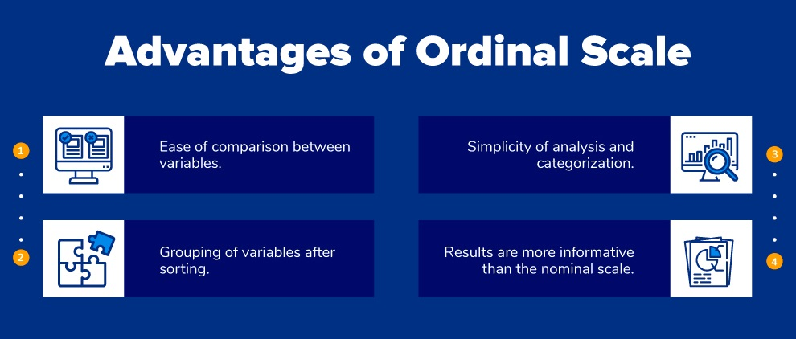

# Ordinal Scale

Ordinal scale is the 2nd level of measurement that reports the ranking and ordering of the data without actually establishing the degree of variation between them. Ordinal level of measurement is the second of the four measurement scales.

“Ordinal” indicates “order”. Ordinal data is quantitative data which have naturally occurring orders and the difference between is unknown. It can be named, grouped and also ranked.

For example:

| “How satisfied are you with our products?” | “How happy are you with the customer service?” |
|--------------------------------------------|------------------------------------------------|
|    1 - Totally Satisfied                   | 1 - Very Unhappy                               |
|    2 - Satisfied                           | 2 - Unhappy                                    |
|    3 - Neutral                             | 3 - Neutral                                    |
|    4 - Dissatisfied                        | 4 - Unhappy                                    |
|    5 - Totally Dissatisfied                | 5 - Very Unhappy                               |

Survey respondents will choose between these options of satisfaction but the answer to “how much?” will remain unanswered. The understanding of various scales helps statisticians and researchers so that the use of data analysis techniques can be applied accordingly.

Thus, an ordinal scale is used as a comparison parameter to understand whether the variables are greater or lesser than one another using sorting. The central tendency of the ordinal scale is Median.

[Likert Scale](./questiontype/likertscale.md) is an example of why the interval difference between ordinal variables cannot be concluded. In this scale the answer options usually polar such as, “Totally satisfied” to “Totally dissatisfied”.

The intensity of difference between these options can’t be related to specific values as the difference value between totally satisfied and totally dissatisfied will be much larger than the difference between satisfied and neutral. If someone loves Mercedes Benz cars and is asked “How likely are you to recommend Mercedes Benz to your friends and family?” will be troubled to choose between Extremely likely and Likely. Thus, an ordinal scale is used when the order of options is to be deduced and not when the interval difference is also to be established.

## Ordinal Characteristics

- Along with identifying and describing the magnitude, the ordinal scale shows the relative rank of variables.
- The properties of the interval are not known.
- Measurement of non-numeric attributes such as frequency, satisfaction, happiness etc.
- In addition to the information provided by nominal scale, ordinal scale identifies the rank of variables.
- Using this scale, survey makers can analyze the degree of agreement among respondents with respect to the identified order of the variables.

## Advantages of Ordinal Scale

- The primary advantage of using ordinal scale is the ease of comparison between variables.
- Extremely convenient to group the variables after ordering them.
- Effectively used in surveys, polls, and questionnaires due to the simplicity of analysis and categorization. Collected responses are easily compared to draw impactful conclusions about the target audience.
- As the values are indicated in a relative manner using a linear rating scale, the results are more informative than the nominal scale.

## Ordinal Examples

- Ranking of high school students – 1st, 3rd, 4th, 10th… Nth. A student scoring 99/100 would be the 1st rank, another student scoring 92/100 would be 3rd and so on and so forth.
- Rating surveys in restaurants –  When a waiter gets a paper or online survey with a question: “How satisfied are you with the dining experience?” having 0-10 option, 0 being extremely dissatisfied and 10 being extremely satisfied.
- Likert Scale – The [Likert Scale](./questiontype/likertscale.md) is a variant of the ordinal scale that is used to calculate customer or employee satisfaction.

- Understanding the socio-economic background of the target [audience](https://www.questionpro.com/audience/) – Rich, middle class, poor etc. fall under the [ordinal data](https://www.questionpro.com/blog/ordinal-data/) category.
- The frequency of occurrence – Questions such as “How frequently do you have to get the phone repaired?”
    *   Very often
    *   Often
    *   Not Often
    *   Not at all
- Evaluating the degree of agreement – State your level of agreement with the company policies:
    *   Totally agree
    *   Agree
    *   Neutral
    *   Disagree
    *   Totally disagree
- Understanding preferences: If a marketer conducts surveys to understand which laptop brand do their respondents do not prefer, they can use the ordinal scale. Out of the five mentioned laptop brand, rate the order of preference –
    *    HP
    *   Apple
    *   Lenovo
    *   Dell
    *   Acer