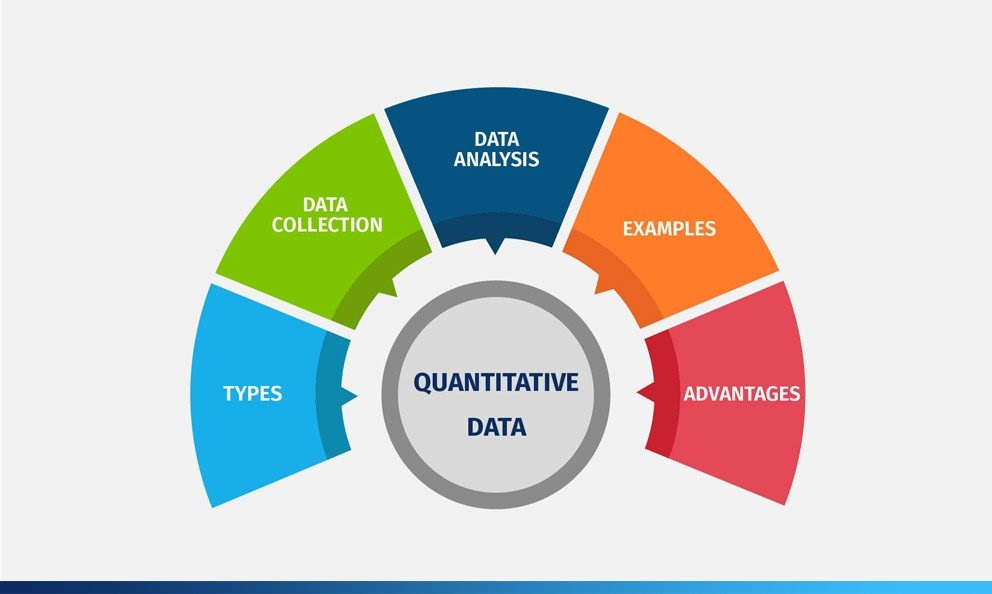
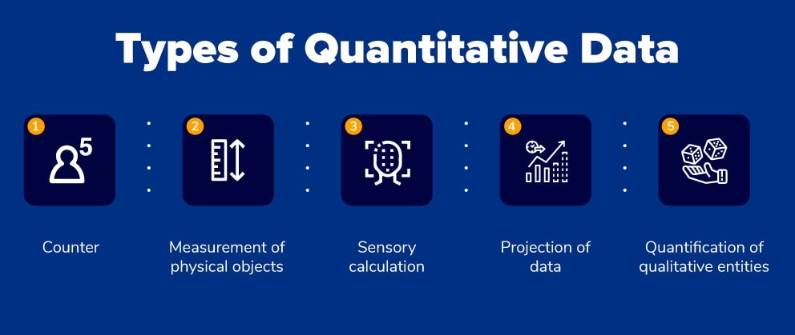

# Quantitative data

## What is Quantitative Data?

Quantitative data is the value of data in the form of counts or numbers where each data set has a unique numerical value. This data is any quantifiable information that researchers can use for mathematical calculations and statistical analysis to make real-life decisions based on these mathematical derivations.

Quantitative data answer questions such as “How many?”, “How often?”, “How much?”. This data can be verified and conveniently evaluated using mathematical techniques.

For example, there are quantities corresponding to various parameters. For instance, “How much did that laptop cost?” is a question that will collect quantitative data. Values are associated with most measuring parameters such as pounds or kilograms for weight, dollars for cost, etc.

Quantitative data makes measuring various parameters controllable due to the ease of mathematical derivations they come with. It is usually collected for statistical analysis using [surveys](https://www.questionpro.com/blog/surveys/), [polls,](https://www.questionpro.com/online-poll.html) or [questionnaires](https://www.questionpro.com/blog/what-is-a-questionnaire/) sent across to a specific section of a population. Researches can establish the retrieved results across a population.

## Types of Quantitative Data with Examples

The most common types of quantitative data are as below:

*   **Counter:** Count equated with entities. For example, the number of people downloading a particular application from the App Store.
*   **Measurement of physical objects:** Calculating measurement of any physical thing. For example, the HR executive carefully measures the size of each cubicle assigned to the newly joined employees.
*   **Sensory calculation:** Mechanism to naturally “sense” the measured parameters to create a constant source of information. For example, a digital camera converts electromagnetic information to a string of numerical data.
*   **Projection of data:** Future data projection can be made using algorithms and other mathematical analysis tools. For example, a marketer will predict an increase in sales after launching a new product with a thorough analysis.
*   **Quantification of qualitative entities:** Identify numbers to qualitative information. For example, asking respondents of an [online survey](https://www.questionpro.com/blog/what-are-online-surveys/) to share the likelihood of recommendation on a scale of 0-10.  

## Quantitative Data: Collection Methods

As quantitative data is in the form of numbers, mathematical and [statistical analysis](https://www.questionpro.com/blog/statistical-analysis/) of these numbers can lead to establishing some conclusive results.

There are two main Quantitative Data Collection Methods:

**Surveys:** Traditionally, surveys were conducted using paper-based methods and have gradually evolved into online mediums. [Closed-ended questions](https://www.questionpro.com/close-ended-questions.html) form a major part of these surveys as they are more effective in collecting quantitative data. The survey makes include answer options which they think are the most appropriate for a particular question. Surveys are integral in collecting feedback from an [audience](https://www.questionpro.com/audience/) which is larger than the conventional size. A critical factor about surveys is that the responses collected should be such that they can be generalized to the entire population without significant discrepancies. On the basis of the time involved in completing surveys, they are classified into the following –

*   **Longitudinal Studies:** A type of observational research in which the market researcher conducts surveys from a specific time period to another, i.e., over a considerable course of time, is called [longitudinal survey](https://www.questionpro.com/blog/longitudinal-study/). This survey is often implemented for [trend analysis](https://www.questionpro.com/features/trend-analysis.html) or studies where the primary objective is to collect and analyze a pattern in data.
*   **Cross-sectional Studies:** A type of observational research in which the market research conducts surveys at a particular time period across the target [sample](https://www.questionpro.com/blog/sample/) is known as [cross-sectional survey](https://www.questionpro.com/blog/cross-sectional-study/). This survey type implements a questionnaire to understand a specific subject from the sample at a definite time period.

To administer a survey to collect quantitative data, the below principles are to be followed.

*   **Fundamental Levels of Measurement – Nominal, Ordinal, Interval and Ratio Scales:** There are four measurement scales which are fundamental to creating a [multiple-choice question](https://www.questionpro.com/article/multiple-choice-questions.html) in a survey in collecting quantitative data. They are, [nominal, ordinal, interval and ratio](https://www.questionpro.com/blog/nominal-ordinal-interval-ratio/) measurement scales without the fundamentals of which, no multiple choice questions can be created.
*   **Use of Different Question Types:** To collect quantitative data, [close-ended questions](https://www.questionpro.com/close-ended-questions.html) have to be used in a survey. They can be a mix of multiple [question types](https://www.questionpro.com/article/types-of-questions-question-types.html) including [multiple-choice questions](https://www.questionpro.com/article/multiple-choice-questions.html) like [semantic differential scale questions](https://www.questionpro.com/semantic-differential-scale.html), [rating scale questions](https://www.questionpro.com/blog/rating-scale/) etc. that can help collect data that can be analyzed and made sense of.
*   **Survey Distribution and Survey Data Collection:** In the above, we have seen the process of building a survey along with the [survey design](https://www.questionpro.com/features/survey-design/) to collect quantitative data. Survey distribution to collect data is the other important aspect of the survey process. There are different ways of [survey distribution](https://www.questionpro.com/features/distributed-via-QRcodes.html). Some of the most commonly used methods are:

*   *   **Email:** Sending a survey via email is the most commonly used and most effective methods of survey distribution. You can use the QuestionPro email management feature to send out and collect survey responses.
    *   **Buy respondents:** Another effective way to distribute a survey and collect quantitative data is to use a sample. Since the respondents are knowledgeable and also are open to participating in research studies, the responses are much higher.
    *   **Embed survey in a website:** Embedding a survey in a website increases a high number of responses as the respondent is already in close proximity to the brand when the survey pops up.
    *   **Social distribution:** Using [social media to distribute the survey](https://www.questionpro.com/features/social-network.html) aids in collecting higher number of responses from the people that are aware of the brand.
    *   **QR code:** QuestionPro QR codes store the URL for the survey. You can [print/publish this code](https://www.questionpro.com/blog/lets-code-in-qr/) in magazines, on signs, business cards, or on just about any object/medium.
    *   **SMS survey:** A quick and time effective way of conducting a survey to collect a high number of responses is the [SMS survey](https://www.questionpro.com/blog/sms-surveys/).
    *   **QuestionPro app:** The [QuestionPro App](https://www.questionpro.com/mobile/) allows to quickly circulate surveys and the responses can be collected both online and [offline](https://www.questionpro.com/mobile/offline.html).
    *   **API integration:** You can use the [API integration](https://www.questionpro.com/api/) of the QuestionPro platform for potential respondents to take your survey.

**One-on-one Interviews:** This quantitative [data collection](https://www.questionpro.com/blog/data-collection/) method was also traditionally conducted face-to-face but has shifted to telephonic and online platforms. [Interviews](https://www.questionpro.com/blog/types-of-interviews/) offer a marketer the opportunity to gather extensive data from the participants. Quantitative interviews are immensely structured and play a key role in collecting information. There are three major sections of these online interviews:

*   **Face-to-Face Interviews:** An interviewer can prepare a list of important [interview questions](https://www.questionpro.com/blog/interview-questions/) in addition to the already asked [survey questions](https://www.questionpro.com/article/survey-question-answer-type.html). This way, interviewees provide exhaustive details about the topic under discussion. An interviewer can manage to bond with the interviewee on a personal level which will help him/her to collect more details about the topic due to which the responses also improve. Interviewers can also ask for an explanation from the interviewees about unclear answers.

*   **Online/Telephonic Interviews:** Telephone-based interviews are no more a novelty but these quantitative interviews have also moved to online mediums such as Skype or Zoom. Irrespective of the distance between the interviewer and the interviewee and their corresponding time zones, communication becomes one-click away with online interviews. In case of telephone interviews, the interview is merely a phone call away.

*   **Computer Assisted Personal Interview: This is a one-on-one interview technique where the interviewer enters all the collected data directly into a laptop or any other similar device. The processing time is reduced and also the interviewers don’t have to carry physical questionnaires and merely enter the answers in the laptop.**

All of the above [quantitative data collection](https://www.questionpro.com/blog/quantitative-data-collection-methods/) methods can be achieved by using [surveys](https://www.questionpro.com/blog/surveys/), [questionnaires](https://www.questionpro.com/blog/what-is-a-questionnaire/) and [online polls](https://www.questionpro.com/polls/online-polls.html).

### Quantitative Data: Analysis Methods

[Data collection](https://www.questionpro.com/blog/data-collection/) forms a major part of the research process. This data however has to be analyzed to make sense of. There are multiple methods of analyzing quantitative data collected in [surveys](https://www.questionpro.com/blog/surveys/). They are:

*   **Cross-tabulation:** [Cross-tabulation](https://www.questionpro.com/cross-tabulation.html) is the most widely used quantitative data analysis methods. It is a preferred method since it uses a basic tabular form to draw inferences between different data-sets in the [research](https://www.questionpro.com/blog/what-is-research/) study. It contains data that is mutually exclusive or have some connection with each other.
*   **Trend analysis:** [Trend analysis](https://www.questionpro.com/features/trend-analysis.html) is a statistical analysis method that provides the ability to look at quantitative data that has been collected over a long period of time. This data analysis method helps collect feedback about data changes over time and if aims to understand the change in variables considering one variable remains unchanged.
*   **MaxDiff analysis:** The [MaxDiff analysis](https://www.questionpro.com/max-diff/) is a quantitative data analysis method that is used to gauge customer preferences for a purchase and what parameters rank higher than the others in this process. In a simplistic form, this method is also called the “best-worst” method. This method is very similar to conjoint analysis but is much easier to implement and can be interchangeably used.  
*   **Conjoint analysis:** Like in the above method, [conjoint analysis](https://www.questionpro.com/blog/what-is-conjoint-analysis/) is a similar quantitative data analysis method that analyzes parameters behind a purchasing decision. This method possesses the ability to collect and analyze advanced metrics which provide an in-depth insight into purchasing decisions as well as the parameters that rank the most important.
*   **TURF analysis:** [TURF analysis](https://www.questionpro.com/article/turf-analysis.html) or Total Unduplicated Reach and Frequency Analysis, is a quantitative data analysis methodology that assesses the total market reach of a product or service or a mix of both. This method is used by organizations to understand the frequency and the avenues at which their messaging reaches customers and prospective customers which helps them tweak their go-to-market strategies.
*   **Gap analysis:** [Gap analysis](https://www.questionpro.com/features/gap-analysis.html) uses a [side-by-side matrix](https://www.questionpro.com/features/side-by-side-matrix.html) to depict quantitative data that helps measure the difference between expected performance and actual performance. This data analysis helps measure gaps in performance and the things that are required to be done to bridge this gap.
*   **SWOT analysis:** [SWOT analysis](https://www.questionpro.com/blog/swot-analysis-example/), is a quantitative data analysis methods that assigns numerical values to indicate strength, weaknesses, opportunities and threats of an organization or product or service which in turn provides a holistic picture about competition. This method helps to create effective business strategies.
*   **Text analysis:** [Text analysis](https://www.questionpro.com/tour/text-analysis.html) is an advanced statistical method where intelligent tools make sense of and quantify or fashion [qualitative](https://www.questionpro.com/blog/qualitative-data/) and [open-ended data](https://www.questionpro.com/blog/what-are-open-ended-questions/) into easily understandable data. This method is used when the raw survey data is unstructured but has to be brought into a structure that makes sense.

#### Steps to conduct Quantitative Data Analysis

For Quantitative Data, raw information has to presented in a meaningful manner using [data analysis](https://www.questionpro.com/blog/what-is-data-analysis/) methods. Quantitative data should be analyzed in order to find evidential data that would help in the research process.

*   **Relate measurement scales with variables:** Associate measurement scales such as Nominal, Ordinal, Interval and Ratio with the variables. This step is important to arrange the data in proper order. Data can be entered into an excel sheet to organize it in a specific format.
*   **Connect descriptive statistics with data:** Link descriptive statistics to encapsulate available data. It can be difficult to establish a pattern in the raw data. Some widely used descriptive statistics are:
    1.  1.  Mean- An average of values for a specific variable
        2.  Median- A midpoint of the value scale for a variable
        3.  Mode- For a variable, the most common value
        4.  Frequency- Number of times a particular value is observed in the scale
        5.  Minimum and Maximum Values- Lowest and highest values for a scale
        6.  Percentages- Format to express scores and set of values for variables
*   **Decide a measurement scale:** It is important to decide the measurement scale to conclude descriptive statistics for the variable. For instance, a nominal variable score will never have a mean or median and so the descriptive statistics will correspondingly vary. Descriptive statistics suffice in situations where the results are not to be generalized to the population.
*   **Select appropriate tables to represent data and analyze collected data:** After deciding on a suitable measurement scale, researchers can use a tabular format to represent data. This data can be analyzed using various techniques such as Cross-tabulation or TURF.  

## Quantitative Data Examples

Listed below are some examples of quantitative data that can help understand exactly what this pertains:

*   I updated my phone **6 times** in a quarter.
*   My teenager grew by **3 inches** last year.
*   **83 people** downloaded the latest mobile application.
*   My aunt lost **18 pounds** last year.
*   **150 respondents** were of the opinion that the new product feature will not be successful.
*   There will be **30% increase** in revenue with the inclusion of a new product.
*   **500 people** attended the seminar.
*   **54% people** prefer shopping online instead of going to the mall.
*   She has **10 holidays** in this year.
*   Product X costs **$1000**.

As you can see in the above 10 examples, there is a numerical value assigned to each parameter and this is known as, quantitative data.

### Advantages of Quantitative Data

Some of the advantages of quantitative data are:

*   **Conduct in-depth research:** Since quantitative data can be statistically analyzed, it is highly likely that the research will be detailed.
*   **Minimum bias:** There are instances in research, where personal bias is involved which leads to incorrect results. Due to the numerical nature of quantitative data, personal bias is reduced to a great extent.
*   **Accurate results:** As the results obtained are objective in nature, they are extremely accurate.

### Disadvantages of Quantitative Data

Some of disadvantages of quantitative data, are:

*   **Restricted information: Because quantitative data is not descriptive, it becomes difficult for researchers to make decisions based solely on the collected information.**
*   **Depends on question types:** Bias in results is dependent on the question types included to collect quantitative data. The researcher’s knowledge of questions and the objective of research are exceedingly important while collecting quantitative data.

### Differences between Quantitative and Qualitative Data

There are some stark differences between quantitative data and qualitative data. They are:

| Quantitative Data | Qualitative Data |
|-------------------|------------------|
| Associated with numbers | Associated with details |
| Implemented when data is numerical |  Implemented when data can be segregated into well-defined groups |
| Collected data can be statistically analyzed | Collected data can just be observed and not evaluated |
| Examples: Height, Weight, Time, Price, Temperature, etc. | Examples: Scents, Appearance, Beauty, Colors, Flavors, etc. |
