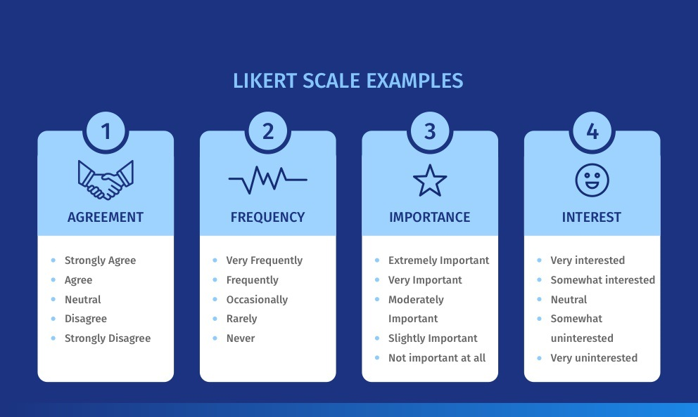

# Likert Scale

An essential aspect of market research for researchers is the ability to gauge the respondents’ opinion towards a brand, feature, product, service, and more. Measuring opinions helps to measure the level of changes required. Using a quantitative data collection tool in the research process, like a Likert scale, allows research teams to understand respondent sentiments. Quantifying a like or dislike aids in making timely changes and supplies a critical tool in the insights collection and management process of brand and research teams.

## What is a Likert scale?

Definition: A Likert scale is a unidimensional scale that researchers use to collect respondents’ attitudes and opinions. Researchers often use this psychometric scale to understand the views and perspectives towards a brand, product, or target market.

Different variations of Likert scales are focused directly on measuring people’s opinions, such as the Guttman scale, Bogardus scale, and Thurstone scale. Psychologist Rensis Likert established a distinction between a scale that materializes from a collection of responses to a group of items (maybe 8 or more). Responses are measured in a range of values.

## Example of a Likert scale

For example, to collect product feedback, the researcher uses a Likert Scale question in the form of a dichotomous option question.  He/ she frames the question as “The product was a good purchase” with the options listed as agree or disagree. The other way to frame this question is, “Please state your satisfaction level with the products,” and the options ranging from very dissatisfied to very satisfied.

When responding to an item on the Likert Scale, the user responds based explicitly on their agreement or disagreement level. These scales allow determining the level of agreement or disagreement of the respondents. The Likert scale assumes that the strength and intensity of the experience are linear. Therefore it goes from a complete agreement to a complete disagreement, assuming that attitudes can be measured.

## Types of Likert Scales

The Likert Scale has become a favourite among researchers to collect opinions about customer satisfaction or employee experience. You can divide this scale primarily into two major types:

- Even Likert Scale
- Odd Likert Scale

### Even Likert Scale
Researchers use even Likert scales to collect extreme feedback without providing a neutral option.

- 4-Point Likert Scale for importance: This type of Likert scale allows researchers to include four extreme options without a neutral choice. Here the various degrees of importance are represented in a 4-Point Likert Scale.
- 8-Point Likelihood of recommendation: This is a variation of the previously explained 4-point Likert scale, the only difference being, this scale has eight options to collect feedback about the likelihood of a recommendation.

### Odd Likert Scale
Researchers use the odd Likert scale to give the respondents the choice of responding neutrally.

- 5-point Likert scale: With five answer options, researchers use this odd Likert scale question to gather information about a topic by including a neutral answer option for respondents to select if they don’t wish to answer from the extreme choices in their research design. 
- 7-point Likert scale: The 7-point Likert scale adds two more answer options at extreme ends of a 5-point Likert scale question.
- 9-point Likert scale: A 9-point Likert scale is quite uncommon, but you can use it by adding two more answer options to the 7-point Likert scale question.

## Characteristics of Likert scale

The Likert scale came into existence in 1932 in the form of the 5-point scale, which is used extensively. These scales range from a group of general topics to the most specific ones that ask respondents to indicate their level of agreement, approval or, belief. Some significant characteristics of the Likert scale, are:

*   **Related answers:** Items should be easily related to the sentence’s answers, regardless of whether the relationship between item and sentence is evident.
*   **Scale type:** The items must always have two extreme positions and an intermediate answer option that serves as graduation between the extremes.
*   **Number of answer options:** It is essential to mention that although the most common Likert scale is that of 5 items, the use of more items helps to generate greater precision in the results.
*   **Increasing reliability of the scale:** Researchers often increase the ends of the scale to create a seven-point scale by adding “very” to the top and bottom of the five-point scales. The seven-point scale reaches the upper limits of the reliability of the scale.
*   **Using wide scales:** As a general rule, Likert and others recommend that it be better to use a scale as wide as possible. One can always collapse the answers into concise groups, if appropriate, for analysis.
*   **Lack of a neutral option:** By considering these details, scales are sometimes curtailed to an even number of categories (usually four) to eliminate the “neutral” possibility on a “forced choice” survey scale.
*   **Intrinsic variable:** The primary Likert record clearly states that there could be an inherent variable whose value marks the feedback or attitudes of the respondents, and this underlying variable is the interval level, at best.

### Likert scale data and analysis

Researchers use surveys regularly to measure and analyze the quality of products or services. The Likert scale is a standard classification format for studies. The respondents provide their opinion (data) about the quality of a product/service from high to low or better to worse using two, four, five, or seven levels.

Researchers and auditors generally group collected data into a hierarchy of four fundamental measurement levels – nominal, ordinal, interval, and ratio measurement levels for further analysis:

*   **Nominal data:** Data in which the answers classified into variables need not necessarily have [quantitative data](https://www.questionpro.com/blog/quantitative-data/) or order is called [nominal data](https://www.questionpro.com/blog/nominal-data/).
*   **Ordinal data:** Data in which it is possible to sort or classify the answers, but it is impossible to measure the distance is called [ordinal data](https://www.questionpro.com/blog/ordinal-data/).
*   **Interval data:** Aggregate data in which measurements of orders and distances can be made is called [interval data](https://www.questionpro.com/blog/interval-data/).
*   **Ratio data:** Ratio data is similar to interval data. The only difference is an equal and definitive ratio between each data and absolute “zero” being treated as a point of origin.

Data analysis using nominal, interval, and ratio data are generally transparent and straightforward. Ordinal data analyzes data, particularly in regards to Likert or other scales in the surveys. This is not a new problem. The effectiveness of handling ordinal data as interval data continues to be debatable in survey analysis of various applied fields. Some of the significant points to keep in mind are:

*   **Statistical tests:** Researchers sometimes treat ordinal data as interval data because they claim that parametric statistical tests are more powerful than nonparametric alternatives. Moreover, inferences from parametric tests are easy to interpret and provide more information than non-parametric options.
*   **Concentration on Likert scales:** However, the treatment of ordinal data as interval data without examining the values ​​of the data set and the analysis’s objectives can mislead and misrepresent the results of a survey. To analyze scalar data more appropriately, researchers prefer to consider ordinal data as interval data and concentrate on Likert scales.
*   **Median or range for inspecting data:** A universal guideline suggests that the mean and the standard deviation are baseless parameters for detailed statistics when the data are on [ordinal scales](https://www.questionpro.com/blog/ordinal-scale/), just like any parametric analysis based on normal distribution. The non-parametric test is done based on the appropriate median or range for inspecting data.

## Best practices for analyzing the results of Likert scales

Because the Likert element data is discrete, ordinal, and limited in scope, there has been a long dispute over the most logical way to analyze Likert data. The first option is between parametric and non-parametric tests. The advantages and disadvantages of each type of analysis are generally described as the following:

*   Parametric tests assume a regular and uninterrupted division.
*   Non-parametric tests do not assume a regular or uninterrupted division. However, there are concerns about a lesser ability to detect a difference when one exists.

Which is the best option? This is a real decision that a researcher has to make when deciding to analyze information received from a [survey](https://www.questionpro.com/blog/surveys/) that uses [Likert Scale questions](https://www.questionpro.com/article/likert-scale-survey-questions.html).

*   Over the years, a series of studies that have tried to answer this question. However, they have been inclined to look at a limited number of potential distributions for Likert data, which causes the generalization of the results to suffer. Thanks to increases in computing power, simulation studies can now thoroughly evaluate a wide range of distributions.
*   The researchers identified a diverse set of 14 distributions that are representative of the actual Likert data. The computer program extracted self-sufficient pairs of samples to test all possible combinations of the 14 distributions.
*   In total, 10,000 random samples were generated for each of the 98 distribution combinations. The samples pairs are analyzed using both the two-sample t-test and the Mann-Whitney test to compare the efficacy of each test. The study also evaluated different sample sizes.
*   The results show that the Type I error rates (false positive) for all pairs of distributions are very close to the target quantities. If an organization uses any of the analysis and results are statistically significant, it does not need to be too worried about a false positive.
*   The results also show that for most pairs of distributions, the difference between the power of the two tests is trivial. If there is a difference at the population level, any of the analysis is equally likely to detect it.
*   There are some pairs of specific distributions where there is a power difference between the two tests. If an organization performs both tests on the same data and does not agree (one is significant, and the other is not), this difference in power affects only a small minority of cases.
*   In general, the choice between the two analyzes is a loop. If an organization needs to compare two groups of five-point Likert data, the analysis method usually does not matter.
*   Both parametric and non-parametric tests consistently provide the same security against false negatives and also offer the same protection against false positives. These patterns are valid for sample sizes of 10, 30, and 200 per group.

## Advantages of Likert scale

There are many advantages of using a Likert Scale in a survey for [market research](https://www.questionpro.com/blog/what-is-market-research/). They are:

*   **Ease of implementation:** This universally accepted scale can be easily understood and applied to various customer satisfaction or employee satisfaction surveys.
*   **Quantifiable answer options:** Quantify Likert items with no apparent relation to the expression and conduct statistical analysis on the received results.
*   **Analyze the rank of opinions:** There may be a [sample](https://www.questionpro.com/blog/sample/) with varied views about a particular topic. The likert scale offers a ranking of the views of these people surveyed.
*   **Simple to respond:** Respondents can understand the intent of this scale and quickly answer the question.
