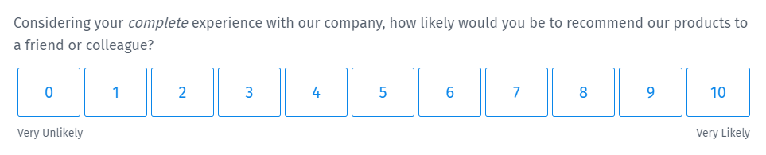
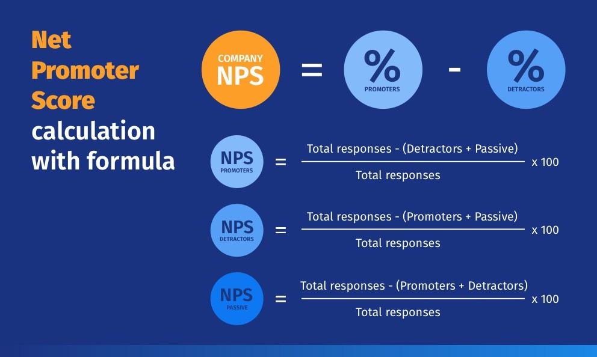

# Net Promoter Score (NPS)

A Net Promoter Score (NPS) survey consists of a single question that measures the likelihood of your customers referring your business to their others. It is an indicator of customer experience, customer satisfaction, and brand loyalty. The responses of the NPS survey are used to generate a score ranging from -100 to 100. The NPS score is used to classify customers and help businesses improve their experience.

## Net Promoter Score NPS survey question
Typical NPS surveys consist of just one question.

Considering your complete experience with our company, how likely would you be to recommend us to your friend or colleague?

The answer options are arranged horizontally on a scale of 0-10.

Based on the score, the customers fall into one of the 3 categories.

- **Promoters**: Customers who rate 9 or 10 and are happy with your services. They are loyal enthusiasts and might prove to be evangelists for your business. They are extremely likely to recommend your company to people in their social or professional circles.
- **Passives**: Customers who rate 7 or 8 and have average experience with your company. They are satisfied with your services but might switch your competitors if given an opportunity. They have a neutral stand - won't spread negative word-of-mouth but won't promote your brand either.
- **Detractor**: Customers who rate below 6 and are not happy with your products or services. They share their bad experiences with others and damage company's reputation. They would not like to repurchase your products or services and would discourage others too.

## Net Promoter Score calculation with formula

You can calculate NPS by subtracting the percentage of detractors from the percentage of promoters.

To calculate the number of promoters, subtract the count of passives and detractors from the total respondents.

## Example of a Net Promoter Score question

Consider a coffeehouse that wants to calculate the Net Promoter Score of its store. The results will give them insights into customer experience and how likely their customers are to refer their coffee shop to others.

Assuming they asked NPS questions to their 100 customers, 40 rated their products and services 9, 20 rated 10, 20 rated 7, 10 rated 8, and 10 customers rated 6 or below.

So, the categorization of the customers is as below.
- Promoters = 40 + 20 (Rating 9 and above)
- Passives = 20 + 20 (Rating 7-8)
- Detractors = 10 (Rating 6 and below)

The coffeehouse company can use the NPS score to connect with the passives and detractors to learn more about their concerns. They can work on the improvement areas and make sure their customers have a great experience. Customer feedback will help them prioritize resources and gain insights into what matters most to them.

Let's say the passive and detractors customers feel that the store needs to have better lighting and chairs. Thus, these data points are driving the NPS score.

A key driver analysis will help the coffeehouse understand their target audience better and what approach they should take for different segments of customers.